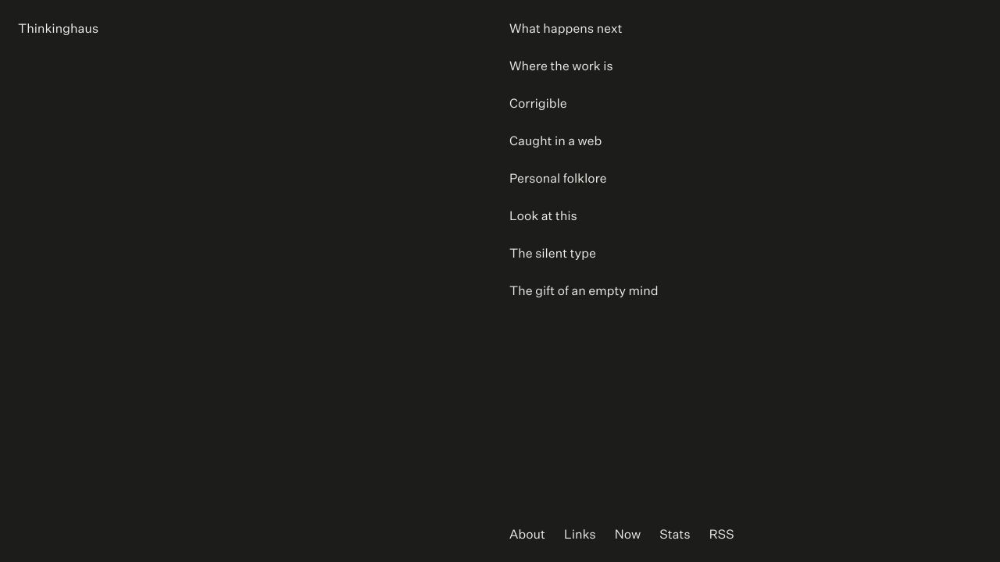

# Thinkinghaus

A deliberately quiet publishing system for essays, observations, and fragments by designer and creative director Max Pfennighaus.

**[Read Thinkinghaus](https://thinking.haus)**



Thinkinghaus began as an experiment in using AI as a genuine writing collaborator—not simply to generate text, but to question, connect, criticize, and help articulate ideas that were still taking shape. The publishing system grew around that practice. It keeps the public site spare while giving the private Studio enough structure for drafting, revision, links, typography, publishing, and a small `/now` archive.

## How it works

Published writing lives as Markdown in `content/`. The private Studio keeps drafts in its own database and writes a document here only when it is published. A push to `main` rebuilds the static site and updates GitHub Pages.

```text
content/posts/   essays and fragments
content/pages/   About, AI, and Links
content/now/     current and archived /now entries
app/             public pages and presentation
scripts/         Markdown parsing and static publishing
integrations/    private chat-to-Studio draft bridge
```

Generated TypeScript modules, RSS, and the sitemap are intentionally not tracked. Development and production builds recreate them from the Markdown source.

## Local checks

```bash
npm install
npm run dev
npm run lint
npm test
```

The static production path is:

```bash
npm run build:pages
node scripts/verify-static-export.mjs
```

## Publishing

Normal writing and publishing happens in Studio. The public repository remains the canonical record of published content, while Studio’s private database remains the canonical record of drafts.

The custom domain depends on `public/CNAME`. GitHub Pages also requires `.nojekyll`, which the publishing workflow adds to the generated branch.

## Design principle

The public site is intentionally spare. Before adding an interface element, ask whether it helps someone find or read the writing. The Studio is a workbench; the public site is the quiet room beyond it.

## Rights

The repository is public so the publishing system and its development can be inspected. Unless otherwise noted, the essays, site content, identity, and original assets remain © Max Pfennighaus and are not offered for reuse.
